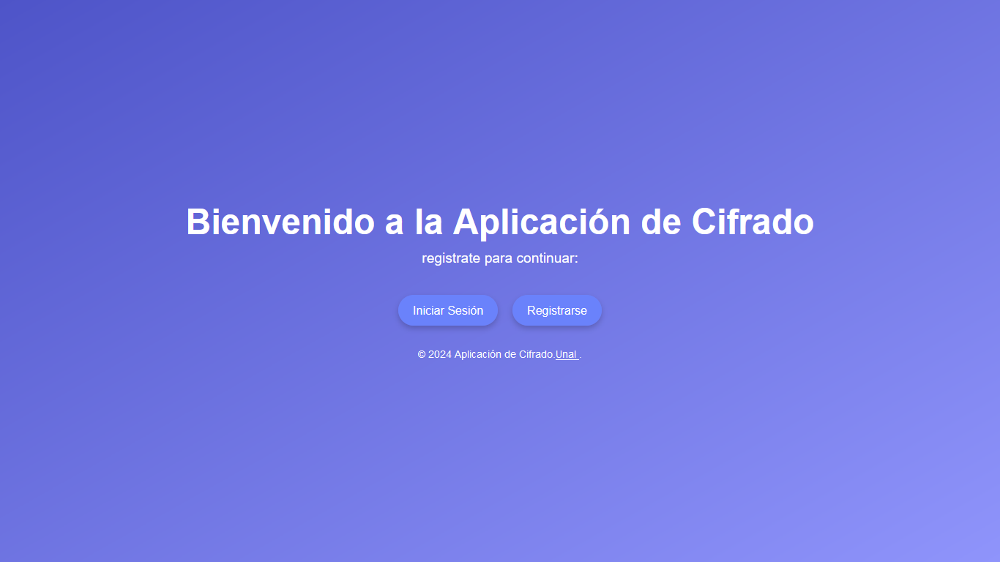
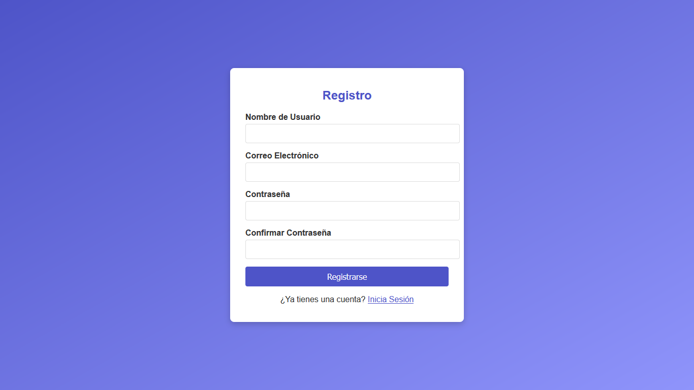
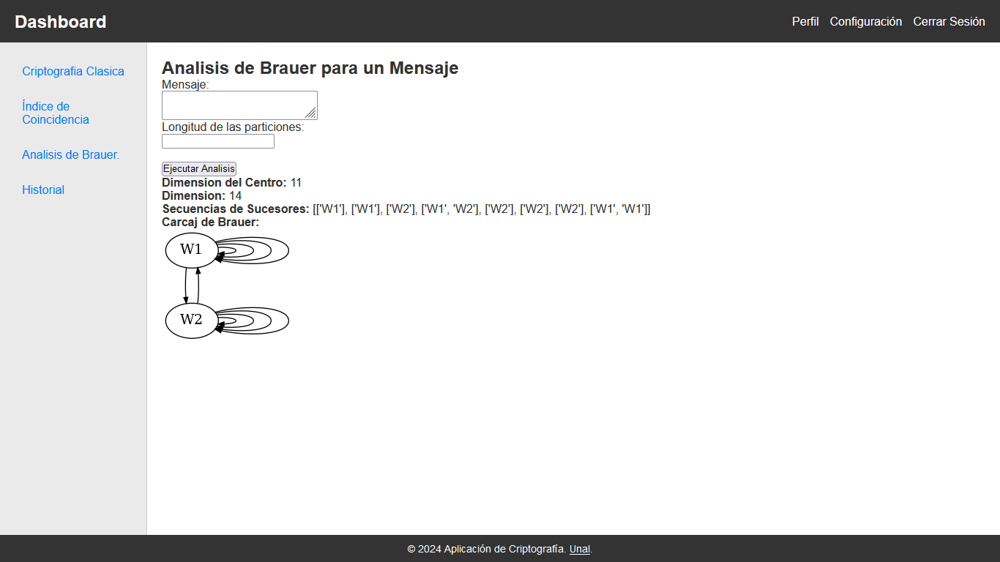

# Manual de Usuario AppCriptografia

¡Bienvenido a AppCriptografia! Esta aplicación te permite explorar varios métodos clásicos de criptografía y analizar textos usando herramientas avanzadas de criptoanálisis. A continuación, te presentamos una guía sobre cómo navegar y utilizar la app de manera eficiente.

Puedes acceder a la AppCriptografía usando el siguiente link: https://jrodriguezru.pythonanywhere.com/

Elaborada por:
- Sarah Daniella Coral Zuniga
- Edison Camilo Huerfano Villalba
- German Daniel Meyer Patarroyo
- Juan Antonio Rodriguez Rubio

---

## 📲 **Pantalla de Inicio**

Cuando abras la app por primera vez, serás recibido con la **Pantalla de Inicio**. En esta pantalla, tienes la opción de **Iniciar sesión** si ya tienes una cuenta, o **Registrarte** si aún no tienes una cuenta.

### Opciones disponibles:
- **Iniciar sesión**: Si ya tienes una cuenta, ingresa tus credenciales y haz clic en **Iniciar sesión** para acceder a la app.
- **Registrarse**: Si no tienes una cuenta, haz clic en **Registrarse** para crear una nueva cuenta.

### Pantalla de Registro
Si eliges la opción de **Registrarse**, serás redirigido a una página donde podrás ingresar tu nombre de usuario, correo electrónico y contraseña, para crear una nueva cuenta.

---

## 🏠 **Dashboard**

Una vez que inicies sesión, serás redirigido al **Dashboard**. Aquí podrás elegir entre diferentes opciones para explorar los métodos criptográficos o realizar análisis avanzados.

### 🖱 **Menú del Banner (Esquina superior derecha)**

En la esquina superior derecha del **Dashboard**, encontrarás el **Menú del Banner**, que te permite acceder rápidamente a las siguientes opciones:

- 👤**Perfil**: Accede a tu perfil de usuario para ver tu información personal.
- 🛠 **Configuración**: Cambia la configuración de la app.
- ❌**Cerrar sesión**: Cierra tu sesión y regresa a la página de login.
  

### Menú del Dashboard:
- **Criptografía Clásica**: Explora varios métodos de cifrado.
- **Índice de Coincidencia**: Analiza el texto para encontrar patrones y coincidencias.
- **Análisis de Brauer**: Un análisis profundo de los cifrados criptográficos.
- **Historial**: Revisa el historial de actividad.

---

## 🔐 **Criptografía Clásica**

La sección de **Criptografía Clásica** es donde podrás explorar diversos métodos de cifrado y descifrado. Aquí tienes una lista de los métodos de cifrado disponibles:

- **Cifrado Vigenère**
- **Cifrado RSA**
- **Cifrado Multiplicativo**
- **Cifrado de Sustitución**
- **Cifrado Hill**
- **Cifrado por Permutación**
- **Cifrado Afín**
- **Cifrado de César o Desplazamiento**

Haz clic en el método de cifrado que deseas explorar, y serás redirigido a una pantalla con opciones para **Cifrar** y **Descifrar**.

---

### 🔑 **Cifrado Vigenère**
Vigenère es un método de cifrado de texto alfabético utilizando una forma simple de sustitución polialfabética.

- **Cifrar**: 
  - En la página de cifrado, ingresa el texto plano en el cuadro de texto **Texto Plano**.
  - Luego, ingresa la **Palabra Clave** en el campo correspondiente.
  - Haz clic en el botón **Cifrar** para obtener el texto cifrado.

- **Descifrar**: 
  - En la página de descifrado, ingresa el texto cifrado en el cuadro de texto **Texto Cifrado**.
  - Introduce la **Palabra Clave** en el campo correspondiente.
  - Haz clic en el botón **Descifrar** para recuperar el texto original.

---

### 🔐 **Cifrado RSA**
RSA es un algoritmo de criptografía asimétrica utilizado para asegurar datos sensibles.

- **Cifrar**: 
  - En la página de cifrado, ingresa el texto plano en el cuadro de texto **Texto Plano**.
  - Luego, ingresa la **Clave Pública** en el campo correspondiente.
  - Haz clic en el botón **Cifrar** para obtener el mensaje cifrado.

- **Descifrar**: 
  - En la página de descifrado, ingresa el texto cifrado en el cuadro de texto **Texto Cifrado**.
  - Introduce la **Clave Privada** en el campo correspondiente.
  - Haz clic en el botón **Descifrar** para recuperar el mensaje original.

---

### 🧮 **Cifrado Multiplicativo**
Un cifrado clásico que cifra sustituyendo cada letra de la posición alfabética por un número fijo multiplicado (mod 26).

- **Cifrar**: 
  - En la página de cifrado, ingresa el texto plano en el cuadro de texto **Texto Plano**.
  - Luego, ingresa el **Multiplicador** en el campo correspondiente.
  - Haz clic en el botón **Cifrar** para obtener el mensaje cifrado.

- **Descifrar**: 
  - En la página de descifrado, ingresa el texto cifrado en el cuadro de texto **Texto Cifrado**.
  - Introduce el **Multiplicador Inverso** en el campo correspondiente.
  - Haz clic en el botón **Descifrar** para recuperar el mensaje original.

---

### 🔠 **Cifrado de Sustitución**
Cada letra del texto claro se reemplaza por otra letra del alfabeto.

- **Cifrar**: 
  - En la página de cifrado, ingresa el texto plano en el cuadro de texto **Texto Plano**.
  - Luego, ingresa el **Alfabeto de Sustitución** en el campo correspondiente.
  - Haz clic en el botón **Cifrar** para obtener el mensaje cifrado.

- **Descifrar**: 
  - En la página de descifrado, ingresa el texto cifrado en el cuadro de texto **Texto Cifrado**.
  - Introduce el **Alfabeto de Sustitución** en el campo correspondiente.
  - Haz clic en el botón **Descifrar** para recuperar el mensaje original.

---

### 🧩 **Cifrado Hill**
Este cifrado aplica álgebra lineal al texto plano utilizando una matriz.

- **Cifrar**: 
  - En la página de cifrado, ingresa el texto plano en el cuadro de texto **Texto Plano**.
  - Luego, ingresa la **Matriz Clave** en el campo correspondiente.
  - Haz clic en el botón **Cifrar** para obtener el mensaje cifrado.

- **Descifrar**: 
  - En la página de descifrado, ingresa el texto cifrado en el cuadro de texto **Texto Cifrado**.
  - Introduce la **Matriz Clave Inversa** en el campo correspondiente.
  - Haz clic en el botón **Descifrar** para recuperar el mensaje original.

---

### 🔀 **Cifrado por Permutación**
Este método de cifrado reordena las letras del texto plano para crear el texto cifrado.

- **Cifrar**: 
  - En la página de cifrado, ingresa el texto plano en el cuadro de texto **Texto Plano**.
  - Luego, ingresa el **Patrón de Permutación** en el campo correspondiente.
  - Haz clic en el botón **Cifrar** para obtener el mensaje cifrado.

- **Descifrar**: 
  - En la página de descifrado, ingresa el texto cifrado en el cuadro de texto **Texto Cifrado**.
  - Introduce el **Patrón de Permutación Inverso** en el campo correspondiente.
  - Haz clic en el botón **Descifrar** para recuperar el mensaje original.

---

### ➗✖️ **Cifrado Afín**
Un cifrado de sustitución que usa tanto adición como multiplicación en el proceso de cifrado.

- **Cifrar**: 
  - En la página de cifrado, ingresa el texto plano en el cuadro de texto **Texto Plano**.
  - Luego, ingresa los valores de **A** y **B** en los campos correspondientes.
  - Haz clic en el botón **Cifrar** para obtener el mensaje cifrado.

- **Descifrar**: 
  - En la página de descifrado, ingresa el texto cifrado en el cuadro de texto **Texto Cifrado**.
  - Introduce los valores de **A** y **B** en el campo correspondiente.
  - Haz clic en el botón **Descifrar** para recuperar el mensaje original.

---

### 🔁 **Cifrado César**
Uno de los cifrados más simples y conocidos, desplaza las letras del alfabeto por un número fijo.

- **Cifrar**: 
  - En la página de cifrado, ingresa el texto plano en el cuadro de texto **Texto Plano**.
  - Luego, ingresa el **Desplazamiento** en el campo correspondiente.
  - Haz clic en el botón **Cifrar** para obtener el texto cifrado.

- **Descifrar**: 
  - En la página de descifrado, ingresa el texto cifrado en el cuadro de texto **Texto Cifrado**.
  - Introduce el **Desplazamiento** en el campo correspondiente.
  - Haz clic en el botón **Descifrar** para recuperar el texto original.

---

## 🔍 **Índice de Coincidencia**

La **Calculadora de Índice de Coincidencia** te permite analizar un texto en busca de patrones y coincidencias en las frecuencias de las letras. Este análisis puede ayudar a identificar el uso de un cifrado y ofrecer pistas sobre su tipo.

1. Ingresa el **Texto cifrado** en el cuadro de texto correspondiente.
2. Luego, ingresa el valor de la **Longitud máxima a probar** en el selector. Este valor determina el tamaño máximo de la secuencia de letras que se probarán en el análisis de frecuencia, y tiene que ser un entero mayor a 0.
3. Haz clic en el botón **Calcular** para iniciar el análisis. La herramienta calculará el **Índice de Coincidencia** y mostrará los resultados.

**Resultados**:

Una vez realizado el cálculo, se mostrarán los **resultados del índice de coincidencia**, que incluyen las frecuencias de las letras y cómo se comparan con los patrones de texto cifrado común. Esto puede ayudar a identificar posibles claves o patrones de cifrado.

---

## 🎼 **Análisis de Brauer**

La herramienta de **Análisis Brauer** es una función avanzada para el análisis criptográfico.

1. Selecciona **Ejecutar el Análisis de Brauer para un Mensaje**.
2. Ingresa el **Mensaje** en el cuadro de texto correspondiente.
3. Luego, ingresa el valor de la **Longitud de las particiones** en el cuadro de texto correspondiente. Este valor determina el tamaño de las particiones o palabras a analizar.
4. Haz clic en el botón **Ejecutar Análisis** para iniciar el análisis. La herramienta calculará el **Índice de Coincidencia** y mostrará los resultados.

**Resultados**:

Los resultados muestran la siguiente información:
- Dimensión del Centro
- Dimensión
- Secuencias de Sucesores
- Imagen del Carcaj de Brauer

---

## 📜 **Historial**

La sección de **Historial** te permite acceder y revisar las actividades pasadas dentro de la aplicación. Esto incluye un registro detallado de todos los cifrados y descifrados realizados, así como cualquier análisis hecho en el **Índice de Coincidencia** o **Análisis de Brauer**. Esta función es útil para hacer un seguimiento de tu progreso y revisar operaciones previas.

### Funcionalidades del Historial:
- **Ver actividades pasadas**: En esta sección, puedes ver los detalles de las actividades previas, como los textos cifrados, las claves utilizadas, los resultados de los análisis, etc.

---

¡Gracias por usar AppCriptografia! Esperamos que disfrutes explorando el mundo del cifrado y el análisis criptográfico.
